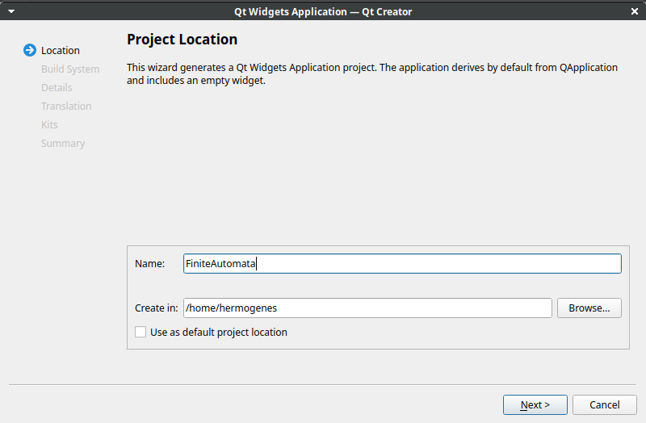
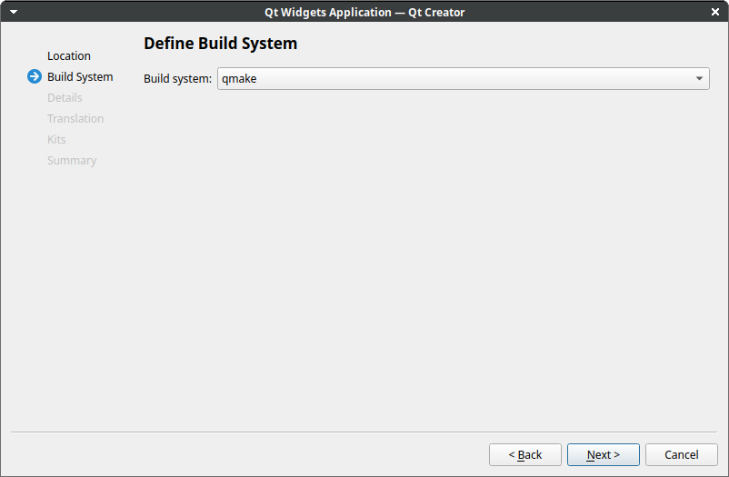
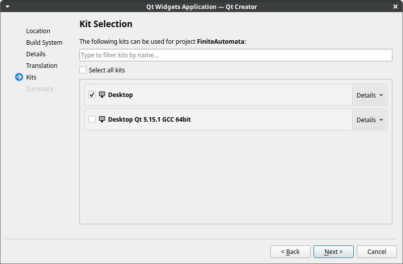
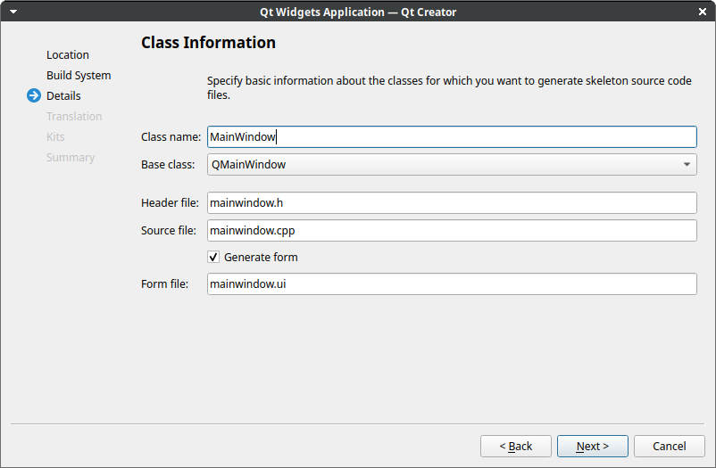
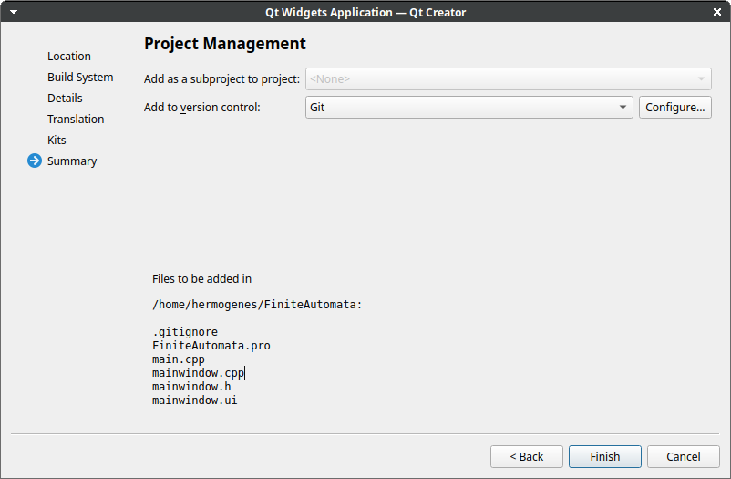
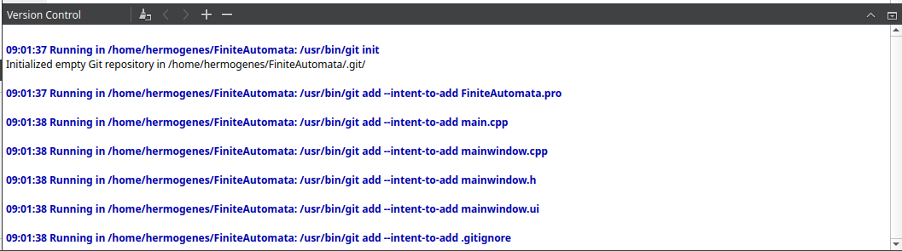

# ISII-Construcción Automática


## QTcreator
<header>
  
</header>
<body>Qt Creator es un IDE multiplataforma programado en C++, JavaScript y QML creado por Trolltech el cual es parte de SDK para el desarrollo de aplicaciones con Interfaces Gráficas de Usuario (GUI por sus siglas en inglés) con las bibliotecas Qt.

### Qmake
La herramienta qmake ayuda a simplificar el proceso de creación de proyectos de desarrollo en diferentes plataformas. Automatiza la generación de Makefiles para que solo se necesiten unas pocas líneas de información para crear cada Makefile. Puede usar qmake para cualquier proyecto de software, ya sea que esté escrito con Qt o no.<br />
Qmake genera un Makefile basado en la información de un archivo de proyecto. Los archivos de proyecto los crea el desarrollador y, por lo general, son simples, pero se pueden crear archivos de proyecto más sofisticados para proyectos complejos. Qmake contiene características adicionales para apoyar el desarrollo con Qt, incluyendo automáticamente reglas de compilación para moc y uic. Qmake también puede generar proyectos para Microsoft Visual Studio sin necesidad de que el desarrollador cambie el archivo del proyecto.
## Instalación
Instalación usando apt en ubuntu <br />


## Construcción del Proyecto
### Creación del proyecto


### Seleccionar Build System
</br> El Archivo de configuracion se genera automaticamente. </br>


 </br> Parte importante del archivo makefile generado con Qmake </br>

``` makefile
####### Compiler, tools and options

CC            = gcc
CXX           = g++
DEFINES       = -DQT_DEPRECATED_WARNINGS -DQT_QML_DEBUG -DQT_WIDGETS_LIB -DQT_GUI_LIB -DQT_CORE_LIB
CFLAGS        = -pipe -g -Wall -Wextra -D_REENTRANT -fPIC $(DEFINES)
CXXFLAGS      = -pipe -g -std=gnu++11 -Wall -Wextra -D_REENTRANT -fPIC $(DEFINES)
INCPATH       = -I../FiniteAutomata -I. -I../../../../Qt/5.15.1/gcc_64/include -I../../../../Qt/5.15.1/gcc_64/include/QtWidgets -I../../../../Qt/5.15.1/gcc_64/include/QtGui -I../../../../Qt/5.15.1/gcc_64/include/QtCore -I. -I/usr/include/libdrm -I. -I../../../../Qt/5.15.1/gcc_64/mkspecs/linux-g++
QMAKE         = /home/hermogenes/Qt/5.15.1/gcc_64/bin/qmake
DEL_FILE      = rm -f
CHK_DIR_EXISTS= test -d
MKDIR         = mkdir -p
COPY          = cp -f
COPY_FILE     = cp -f
COPY_DIR      = cp -f -R
INSTALL_FILE  = install -m 644 -p
INSTALL_PROGRAM = install -m 755 -p
INSTALL_DIR   = cp -f -R
QINSTALL      = /home/hermogenes/Qt/5.15.1/gcc_64/bin/qmake -install qinstall
QINSTALL_PROGRAM = /home/hermogenes/Qt/5.15.1/gcc_64/bin/qmake -install qinstall -exe
DEL_FILE      = rm -f
SYMLINK       = ln -f -s
DEL_DIR       = rmdir
MOVE          = mv -f
TAR           = tar -cf
COMPRESS      = gzip -9f
DISTNAME      = FiniteAutomata1.0.0
DISTDIR = /home/hermogenes/Documents/ISII/TC-master/build-FiniteAutomata-Desktop-Debug/.tmp/FiniteAutomata1.0.0
LINK          = g++
LFLAGS        = -Wl,-rpath,/home/hermogenes/Qt/5.15.1/gcc_64/lib
LIBS          = $(SUBLIBS) /home/hermogenes/Qt/5.15.1/gcc_64/lib/libQt5Widgets.so /home/hermogenes/Qt/5.15.1/gcc_64/lib/libQt5Gui.so /home/hermogenes/Qt/5.15.1/gcc_64/lib/libQt5Core.so -lGL -lpthread   
AR            = ar cqs
RANLIB        = 
SED           = sed
STRIP         = strip

####### Output directory
```

### Seleccionar Kits

### Crear clases del proyecto

### Configurar el control de versiones


<br /> Por defecto se crea un git local, se puede sincronizar con github. <br />



</body>
